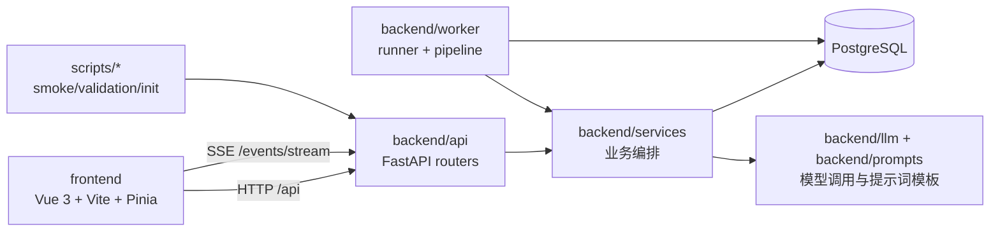

# CLAUDE.md

This file provides guidance to Claude Code (claude.ai/code) when working with code in this repository.

## 项目概览

这是一个“长篇小说生成系统”单仓库：

- `backend/` 是 FastAPI + SQLAlchemy async 后端，负责项目管理、模型配置、章节生成编排、Prompt 版本管理、资源提取与导出。
- `frontend/` 是 Vue 3 + Vite + Pinia 前端，负责项目配置、实时写作监控、Prompt 编辑、资源面板和阅读导出页面。
- `scripts/` 放联调、初始化与验证脚本。
- `docker-compose.yml` 提供本地完整联调环境：PostgreSQL + API + frontend + worker。

核心运行形态不是单个同步请求直接产出章节，而是：API 写入项目/任务状态 → worker 轮询 `GenerationJob` 队列 → pipeline 执行写作/评审/记忆更新 → 事件写入 `ProjectEvent` → 前端通过 SSE 拉实时状态。

## 仓库结构图



## 常用命令

### 后端本地开发

```bash
python -m venv .venv
source .venv/bin/activate
pip install -r backend/requirements-dev.txt
cp .env.example .env
```

启动 API：

```bash
uvicorn backend.main:app --host 0.0.0.0 --port 8000 --reload
```

启动 worker：

```bash
python -m backend.worker.runner
```

数据库迁移：

```bash
alembic upgrade head
```

快速初始化数据库表（仅本地临时使用）：

```bash
python -m scripts.init_db
```

运行后端测试：

```bash
python -m pytest -q
```

运行单个测试文件：

```bash
python -m pytest -q backend/tests/test_prompt_service.py
```

运行单个测试用例：

```bash
python -m pytest -q backend/tests/test_prompt_service.py -k approved
```

### 前端本地开发

安装依赖：

```bash
cd frontend && npm install
```

启动开发服务器（Vite 代理到本地 API）：

```bash
cd frontend && NOVEL_AI_VITE_API_PROXY_TARGET=http://127.0.0.1:8000 npm run dev
```

前端构建：

```bash
cd frontend && npm run build
```

本地预览构建结果：

```bash
cd frontend && npm run preview
```

说明：当前仓库未提供单独 lint 脚本；前端构建本身会先执行 `vue-tsc -b`。

### Docker Compose 联调

首次准备环境变量：

```bash
cp .env.example .env
```

启动全部服务：

```bash
docker compose up -d --build
```

仅在修改 `.env` 的模型地址 / 模型名 / API Key 后重建后端相关服务：

```bash
docker compose up -d api worker
```

如果修改的是宿主机端口映射，重新执行：

```bash
docker compose up -d
```

不要只用 `docker compose restart`，它不会重新加载新的 `.env`。

### 修复后自动生效约定

如果修改了会进入运行中容器的后端代码（例如 `backend/`、`scripts/`、`alembic.ini`，以及任何会影响 `api` / `worker` 镜像内容的文件），并且验证已经通过，默认应让修复立即生效。

统一执行入口：

```bash
./scripts/reload_runtime.sh
```

约定如下：

- 该脚本负责重建并重启 `api` 与 `worker`。
- 代理在完成后端/worker bug 修复且验证通过后，应主动执行该脚本，而不是停留在“代码已修改”。
- 如果只改了前端静态资源，不需要执行该脚本。
- 如果改了 `.env`、模型地址、模型名、API Key 或后端镜像内容，也应执行该脚本。

### 联调与验证脚本

烟雾测试：

```bash
NOVEL_AI_BASE_URL=http://127.0.0.1:8000 python -m scripts.smoke_test
```

五章流程验证：

```bash
NOVEL_AI_BASE_URL=http://127.0.0.1:8050 python -m scripts.validate_five_chapter_flow
```

重试流验证：

```bash
NOVEL_AI_BASE_URL=http://127.0.0.1:8050 python -m scripts.validate_retry_flow
```

真实默认模型三章验证：

```bash
NOVEL_AI_BASE_URL=http://127.0.0.1:8050 python -m scripts.validate_real_default_three_chapter_flow
```

## 高层架构

### 后端分层

后端大体按这几层组织：

- `backend/main.py`：FastAPI 入口，注册 `projects` / `system` / `generation` / `prompts` / `events` / `resources` 路由以及 `/healthz`。
- `backend/api/`：HTTP API 层，主要做请求校验、序列化和服务编排调用。
- `backend/services/`：核心业务层。这里承载项目管理、生成流程控制、Prompt 生成、上下文拼装、事件记录、资源/记忆更新等主要逻辑。
- `backend/worker/`：异步后台执行器。`runner.py` 负责轮询任务与续租，`pipeline.py` 负责真正的章节生成流水线。
- `backend/db/models/` + `backend/db/migrations/`：数据库实体与 Alembic 迁移。
- `backend/llm/` 与 `backend/prompts/`：LLM 抽象和系统提示词模板。

### 生成流水线

章节生成的主流程集中在 `backend/worker/pipeline.py`：

1. worker 从 `GenerationJob` 取出待执行章节。
2. `MemoryService` 做连续性预检查。
3. `PromptService` 生成或复用该章节的有效 Prompt，并保存版本。
4. `ContextService` 组装 writer 上下文。
5. writer 模型按项目级 `writer_streaming_enabled` 走流式或非流式生成正文；流式会持续发 `content_chunk`，非流式会走 `writer_non_stream_started` / `writer_non_stream_succeeded` 事件链路。
6. critic 模型做评分与结构化评审。
7. 通过则写入章节终稿并触发 `MemoryService` 更新摘要/角色/设定修订；失败则按 `max_retries` 重新排队或暂停项目。
8. 全流程通过 `EventService` 持续写入 `ProjectEvent`，供 `/events` 与 `/events/stream` 消费。

理解这个项目时，优先把它看成“基于数据库状态机的生成编排系统”，而不是普通 CRUD API。

### 任务与状态模型

`ProjectService` 和 `GenerationService` 共同维护项目级与章节级状态：

- 项目先创建，再导入大纲；导入大纲时会重置旧的章节、任务、事件、Prompt、摘要和记忆修订数据。
- `GenerationService` 负责启动、暂停、恢复、重试章节，并向 `GenerationJob` 队列表插入任务。
- `auto_mode` 决定单章通过后是自动进入下一章，还是暂停等待手动继续。
- 当 memory 阶段发现高风险设定变更时，项目会自动暂停等待人工复核。

### Prompt 与模型配置

Prompt/模型配置是这个系统的重要轴线：

- 项目级模型配置保存在 `ProjectModelConfig`，角色至少要有 `writer`、`critic`、`memory`；`prompt_builder` 只有在默认配置与 writer 不同的时候才单独落库。
- `backend/config.py` 通过 `NOVEL_AI_*` 环境变量提供默认模型配置。
- API 会校验 `extra_config.api_key_env_var` 是否为合法环境变量名。
- `PromptService` 会把章节大纲、全局 Prompt、连续性预检查、重试信息合并后交给 `prompt_builder` 模型；若失败则回退到内置 fallback Prompt。
- 最终写作使用的是 `BASE_WRITER_RULES + 章节 Prompt` 拼成的 `effective_system_prompt`。

### 事件流与前端实时界面

前端实时能力依赖后端事件表，而不是 WebSocket：

- `backend/api/events.py` 提供普通查询接口和 SSE 接口 `/api/projects/{project_id}/events/stream`。
- worker/pipeline 在写作、评审、记忆更新、暂停、完成等节点都会落事件。
- `frontend/src/views/LiveWriting.vue`、评分/资源相关组件依赖这些事件更新界面。

如果需要改“实时写作页”行为，通常要同时看前端事件消费逻辑和后端 `EventService`/pipeline 发出的事件类型是否匹配。

### 前端结构

前端是典型 Vue SPA：

- `frontend/src/router/index.ts` 定义主路由：项目列表、项目配置、Prompt 编辑、实时写作、阅读页。
- `frontend/src/stores/project.ts` 封装项目、模型配置、大纲导入、启动/暂停/恢复/重试等核心 API 调用。
- `frontend/src/api/index.ts` 统一 axios 实例，`baseURL` 固定为 `/api`，因此本地开发通常依赖 Vite 代理，生产则依赖 Nginx 同域转发。
- `frontend/src/views/ProjectSetup.vue` 负责项目基础信息、模型配置、大纲导入与模型连通性测试。
- 复杂页面由多个面板组件拼装，例如资源面板、Prompt 版本面板、评分面板、章节进度面板。

## 数据与实体关注点

数据库实体分散在 `backend/db/models/` 下，而不是单文件：

- `project.py`：项目与模型配置。
- `chapter.py`：章节、大纲、尝试、评审、摘要等章节相关数据。
- `prompt.py`：章节 Prompt 版本。
- `job.py`：后台任务队列与 lease。
- `event.py`：项目事件流。
- `memory.py`：角色、世界观及其修订记录。

做后端改动前，先确认是否已经有对应状态字段或关联表，不要在 service 层凭空扩展临时结构。

## 模块索引

- `backend/CLAUDE.md`：后端服务、任务系统、模型配置、测试与关键入口。
- `frontend/CLAUDE.md`：前端页面流、状态管理、SSE 消费、构建命令。
- `scripts/CLAUDE.md`：初始化、烟雾测试、端到端验证脚本。

## 深度补扫补充

### 后端高价值子路径

- `backend/services/`：真正的业务编排中心。重点文件是 `generation_service.py`、`prompt_service.py`、`context_service.py`、`memory_service.py`、`runtime_service.py`。
- `backend/db/models/`：状态机与资源持久化的真实约束层。新增字段或状态前先看模型和迁移，不要只改 service。
- `backend/tests/`：已有较明确的测试地图，覆盖重试、Prompt fallback、远期记忆、上下文裁剪、状态恢复等关键行为。

### 前端高价值子路径

- `frontend/src/views/`：页面级业务编排。
- `frontend/src/components/`：实时写作页的评分、资源、Prompt 版本、章节状态等子面板。
- `frontend/src/types/index.ts`：前后端契约集中点；接口联调异常时要和后端序列化一起核对。

### 关键跨模块耦合

- Prompt 变更通常同时影响 `backend/services/prompt_service.py`、`backend/worker/pipeline.py`、`frontend/src/views/PromptEditor.vue`。
- 资源/记忆变更通常同时影响 `backend/services/memory_service.py`、`backend/api/resources.py`、`frontend/src/components/ProjectResourcesPanel.vue`。
- 实时交互变更通常同时影响 `backend/api/events.py`、`backend/worker/pipeline.py`、`frontend/src/views/LiveWriting.vue`。

README 中给出的典型联调顺序是：

1. `POST /api/projects`
2. `PUT /api/projects/{id}/models`
3. `POST /api/projects/{id}/outlines/import`
4. `POST /api/projects/{id}/start`
5. `GET /api/projects/{id}/events/stream`
6. 运行 `scripts.smoke_test`

本地联调模型时，可先把 provider 设为 `mock`，避免真实模型依赖。

## 配置注意事项

- `.env` 才是实际维护的运行配置，`docker-compose.yml` 只是通过 `${VAR:-默认值}` 做引用与兜底。
- 默认需要关注的环境变量主要是宿主机端口、四类默认模型的 `BASE_URL` / `MODEL_NAME`，以及 `WRITER_API_KEY`、`CRITIC_API_KEY`、`MEMORY_API_KEY`、`PROMPT_BUILDER_API_KEY`。
- `pytest.ini` 里设置了 `pythonpath = .`，仓库根目录执行 pytest 即可。
- Docker Compose 中 API 容器启动时会先执行 `alembic upgrade head`。
